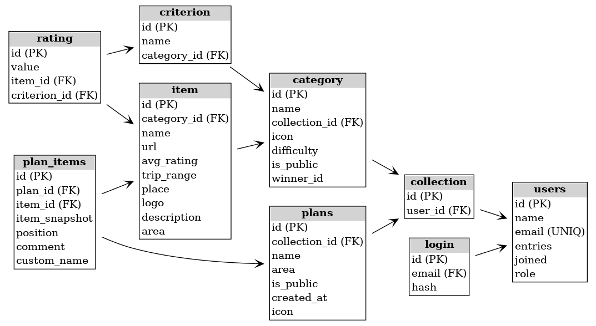

# 📦 PlanIt Database Dump

This repository contains a PostgreSQL database dump (`planit_dump.sql`) for the **PlanIt** project — a personal planning and recommendation app.

The dump includes the full schema and minimal seed data for development, testing, or educational purposes.

---

## 📚 Project Overview

PlanIt is a full-stack web application built with:

- 🔹 Frontend: React
- 🔹 Backend: Node.js + Express
- 🔹 Database: PostgreSQL

This SQL dump was generated from a live Render database using PostgreSQL 16.

---

## 💾 What's Included

- ✅ Full table structure (`CREATE TABLE`, `SEQUENCES`, constraints)
- ✅ Foreign key relationships and validation checks
- ✅ Initial seed data (admin user + login)
- ❌ No owner/privileges
- ❌ No `CREATE DATABASE` or `DROP DATABASE` statements
- 📎 Format: Plain SQL with `INSERT` statements (not `COPY`), UTF-8 encoded

---

## 🚀 How to Restore

Make sure you have PostgreSQL 16 or later installed.

### 1. Create an empty database

```bash
createdb planit
````

### 2. Import the dump

```bash
psql -d planit -f planit_dump.sql
```

---

## 👤 Demo Credentials

This dump includes a sample admin account:

```text
Email:    planit@mail.com
Password: (stored as bcrypt hash)
Role:     admin
```

> ⚠️ These credentials are for demonstration only. Do not use in production.

---

## 🧭 Entity Relationship Diagram

This diagram shows the structure of the database and relationships between tables:



---

## 🛡️ License & Usage

This repository is intended for educational and demonstration purposes.
You are welcome to use it as a reference or foundation for your own projects.

---

## 🤝 Contributions

Suggestions and pull requests are welcome!

If you're building something similar and want to collaborate — feel free to reach out.

```
```
